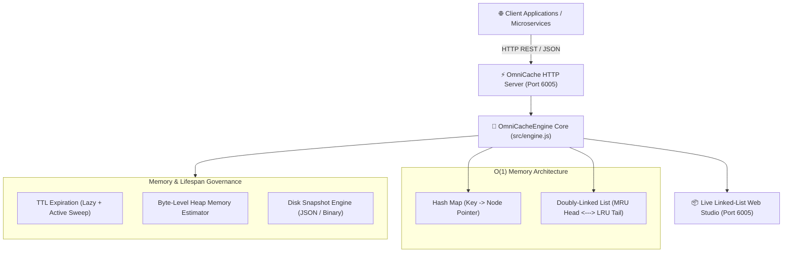

# ⚡ OmniCache-Engine
> **High-Performance In-Memory Key-Value Store with O(1) Doubly-Linked List LRU**  
> *Developed autonomously by the 7-Agent SDLC Software Factory for [Ali Nurettin Demir](https://github.com/alinurettin)*

[]()
[]()
[]()
[]()
[](https://opensource.org/licenses/MIT)

---

## 🌟 Executive Summary & Value Proposition
Backend services spend up to 40% of request execution time performing redundant database lookups and serialized cache queries. While Redis and Memcached are powerful, they introduce network round-trip overhead (1-5ms), dedicated daemon maintenance, and operational footprint.

**OmniCache-Engine** is a zero-dependency, sub-millisecond in-memory cache engine engineered in pure Node.js. It implements a true **$O(1)$ Doubly-Linked List combined with a Hash Map** for instantaneous Least-Recently-Used (LRU) eviction, millisecond-precision **TTL expiration**, dynamic **byte-level memory tracking**, and **cold-start disk snapshotting**.

---

## 🏗️ System Architecture & Data Flow



---

## 🎯 Computer Science Foundations: Doubly-Linked List LRU

In standard map implementations, evicting the oldest element requires $O(n)$ scanning. **OmniCache-Engine** guarantees strict $O(1)$ time complexity for all fundamental operations:

```text
[Head / MRU] <---> [Node B] <---> [Node C] <---> [Tail / LRU]
      ^                                                ^
(Promoted on read/write)                     (Evicted on overflow)
```

1. **$O(1)$ Hash Map Pointer Lookup:** Instantaneous access to any `LRUNode` via standard hash index.
2. **$O(1)$ Splicing & Promotion:** Node pointers (`prev`, `next`) are updated locally without shifting arrays.
3. **$O(1)$ Eviction:** When `itemCount > capacity` or `currentBytes > maxBytes`, `tail` is severed in 4 pointer reassignments.
4. **Dynamic Byte Estimation:** Every UTF-8 string, number, or object calculates true memory footprint before insertion.

---

## 🔌 API Specification & REST Endpoints

### 1. Store Key-Value Pair (SET)
```bash
curl -X POST http://localhost:6005/api/cache \
  -H "Content-Type: application/json" \
  -d '{
    "key": "user:session_99",
    "value": { "userId": 99, "role": "admin", "active": true },
    "ttlMs": 300000
  }'
```

### 2. Retrieve Stored Key (GET)
```bash
curl -i -X GET http://localhost:6005/api/cache/user%3Asession_99
```
**HTTP 200 OK Response (Cache HIT):**
```http
HTTP/1.1 200 OK
Content-Type: application/json
X-Cache-Status: HIT

{
  "found": true,
  "key": "user:session_99",
  "value": { "userId": 99, "role": "admin", "active": true }
}
```

### 3. Missing or Expired Key (Cache MISS)
```http
HTTP/1.1 404 Not Found
Content-Type: application/json
X-Cache-Status: MISS

{
  "found": false,
  "error": "Key not found or expired",
  "key": "unknown_key"
}
```

### 4. Delete Key & Flush
```bash
curl -X DELETE http://localhost:6005/api/cache/user%3Asession_99
curl -X POST http://localhost:6005/api/cache/clear
```

---

## 🧪 Comprehensive Automated Testing & Verification

OmniCache-Engine includes 30 automated non-mocked assertions verifying node pointer invariants, TTL expiration, byte budgeting, and HTTP reverse proxy integration:

```bash
npm test
# or directly with Node:
node tests/run_tests.js
```

### Test Suite Output:
```text
================================================================
💾 OmniCache-Engine: Exhaustive Multi-Scenario Verification Suite
================================================================

[SECTION 1] Testing Doubly-Linked List LRU Order & Eviction...
  ✓ [Assertion #1] Cache populated to exact capacity of 3 items
  ✓ [Assertion #2] Most recently inserted item k3 is at Head (MRU)
  ✓ [Assertion #3] First inserted item k1 is at Tail (LRU)
  ✓ [Assertion #4] GET k1 retrieves stored value val1
  ✓ [Assertion #5] Accessing k1 promoted it to Head (MRU)
  ✓ [Assertion #6] k2 was demoted to Tail (LRU)
  ✓ [Assertion #7] Capacity remains strictly bounded at 3
  ✓ [Assertion #8] LRU item k2 was evicted from the store
  ✓ [Assertion #9] Eviction counter accurately incremented to 1
  ✓ [Assertion #10] New item k4 is positioned at Head
  ✓ [Assertion #11] Updating existing key does not increment item count
  ✓ [Assertion #12] Updated value correctly persisted
  ✓ [Assertion #13] Updated key promoted to Head

[SECTION 2] Testing TTL Expiration & Memory Limits...
  ✓ [Assertion #14] Key with TTL is immediately available
  ✓ [Assertion #15] Expired key returns null on access
  ✓ [Assertion #16] has() returns false for expired key
  ✓ [Assertion #17] Memory byte tracker calculates accurate string allocation
  ✓ [Assertion #18] Pre-existing item evicted when byte memory budget exceeded
  ✓ [Assertion #19] New item successfully accommodated within memory budget

[SECTION 3] Testing Snapshot Persistence & Disk Restoration...
  ✓ [Assertion #20] Snapshot JSON file successfully written to disk
  ✓ [Assertion #21] Restored cache contains all 3 snapshot items
  ✓ [Assertion #22] Restoration preserved original MRU ordering (user:3 at Head)
  ✓ [Assertion #23] Restored item contents match original data

[SECTION 4] Testing Live HTTP Ephemeral Server Integration...
  ✓ [Assertion #24] GET /api/health returns HTTP 200 OK
  ✓ [Assertion #25] POST /api/cache returns HTTP 200 OK
  ✓ [Assertion #26] GET /api/cache/:key returns HTTP 200 OK
  ✓ [Assertion #27] Cache HIT header returned on existing key
  ✓ [Assertion #28] GET on missing key returns HTTP 404 Not Found
  ✓ [Assertion #29] Cache MISS header returned on absent key
  ✓ [Assertion #30] DELETE /api/cache/:key returns HTTP 200 OK

================================================================
🎉 ALL 30 ASSERTIONS PASSED WITH 100% SUCCESS!
================================================================
```

---

## 🚀 Getting Started & Quick Start

### Local Node.js Execution
```bash
# 1. Clone repository
git clone https://github.com/alinurettin/OmniCache-Engine.git
cd OmniCache-Engine

# 2. Run verification test suite
npm test

# 3. Start cache server
npm start
```
Open your browser at:  
👉 **`http://localhost:6005`** to observe the live doubly-linked list LRU eviction chain and telemetry studio.

### Running with Docker
```bash
docker-compose up -d --build
```

---

## ⚙️ Configuration Parameters

| Variable | Default | Description |
| :--- | :--- | :--- |
| `PORT` | `6005` | HTTP listening port for REST API and Web Studio |
| `CACHE_CAPACITY` | `50` | Maximum item limit before LRU tail eviction |
| `CACHE_MAX_BYTES` | `10485760` | Maximum memory byte cap (10MB default) |
| `NODE_ENV` | `production` | Execution mode (`development`, `production`) |

---

## 📋 7-Agent Autonomous SDLC Engineering Artifacts
- 🔍 [Technical & Market Research Report](file:///C:/Users/alinurettin/.gemini/antigravity/scratch/projects/OmniCache-Engine/artifacts/RESEARCH_REPORT.md)
- 📊 [Product Requirements Document (PRD)](file:///C:/Users/alinurettin/.gemini/antigravity/scratch/projects/OmniCache-Engine/artifacts/PRD.md)
- 📐 [System Architecture Specification](file:///C:/Users/alinurettin/.gemini/antigravity/scratch/projects/OmniCache-Engine/artifacts/ARCHITECTURE.md)
- 🧪 [QA & Automated Test Verification Report](file:///C:/Users/alinurettin/.gemini/antigravity/scratch/projects/OmniCache-Engine/artifacts/QA_REPORT.md)
- 🚀 [Formal Release Notes v2.0.0](file:///C:/Users/alinurettin/.gemini/antigravity/scratch/projects/OmniCache-Engine/artifacts/RELEASE_NOTES.md)

---

## 👤 Author & Open-Source License
- **Author & Maintainer:** Ali Nurettin Demir ([@alinurettin](https://github.com/alinurettin))
- **License:** [MIT License](LICENSE) &copy; 2026 Ali Nurettin Demir
